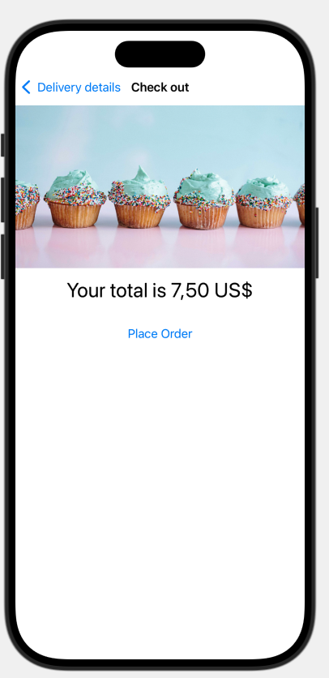

# Cupcake Corner App

This project is a cupcake ordering application that allows users to select the type and quantity of cupcakes, add special requests, and provide delivery details. The app is designed to be intuitive and easy to use, utilizing SwiftUI for a smooth user experience.

## Concepts Learned in This Project

- **Form design with SwiftUI**: Creation of forms and sections to organize data entry.
-**State Management**: Use of '@State`, '@Observable`, and '@Bindable' to maintain and update the state of the application.
- **Navigation**: Implementation of navigation within the application using 'NavigationStack' and 'NavigationLink'.
- **User interface controls**: Use of 'Picker`, 'Stepper`, and 'Toggle' to create an interactive interface.
-**Data encoding and decoding**: Using 'Codable`, 'JSONEncoder`, and 'JSONDecoder' to handle data.
- **Network requests**: Creation of network requests with 'URLRequest'.

## Main features

- **Cupcake type selection**: Users can choose from different types of cupcakes.
- **Quantity of cupcakes**: Users can select the quantity of cupcakes they want to order.
- **Special requests**: Options to add extra frosting and extra sprinkles.
- **Delivery Details**: One view navigation to enter the delivery details.
- **Data persistence and recovery**: Encoding and decoding of order data for persistence and recovery.
- **Order submission**: Sending the order to a server using a network request.

## View of the project

 

## Installation of the project

To install this project:

1. Download the compressed file (.zip).
2. Unzip the file.
3. Open the project with Xcode.
4. Run the simulator by pressing the ▶️ PLAY symbol in the upper left corner or by using the shortcut CMD ⌘ + R.
