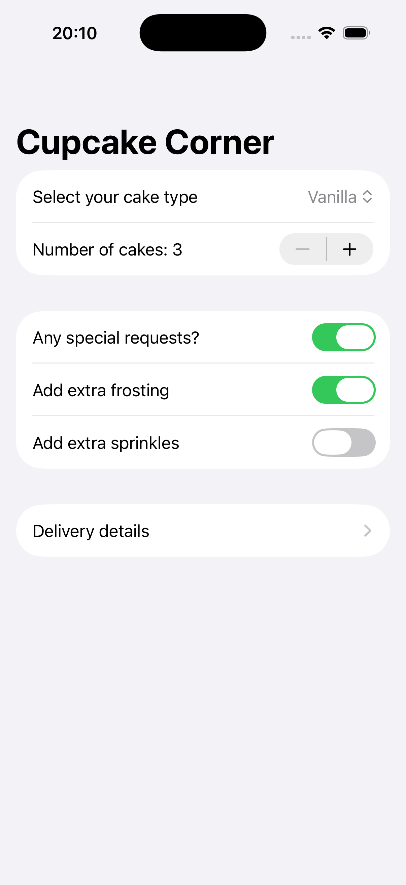
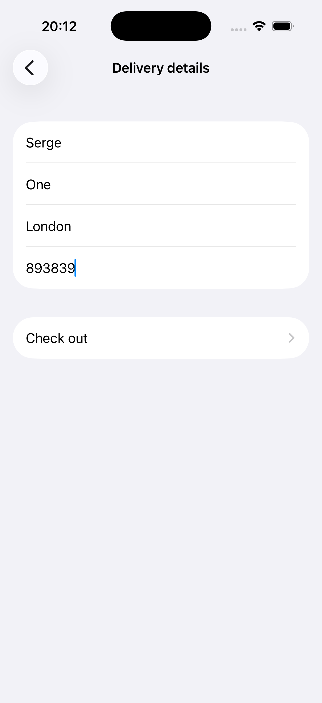

# CupcakeCorner 🧁

**CupcakeCorner** — это приложение для заказа капкейков, которое демонстрирует работу со сложными формами в SwiftUI, обработку сетевых запросов через `URLSession` и валидацию данных в реальном времени.

## ✨ Особенности

- **Выбор заказа**: Пользователь может выбрать тип капкейка, количество и добавить дополнительные опции (экстра-глазурь, посыпка).
- **Валидация адреса**: Система проверяет корректность введенных данных (имя, адрес, город) перед тем, как разрешить оформление заказа.
- **Сетевое взаимодействие**: 
  - Загрузка типов капкейков с сервера.
  - Отправка заказов в формате JSON на тестовый сервер (используется [reqres.in](https://reqres.in)).
- **Обработка ошибок**: Приложение умеет обрабатывать отсутствие интернет-соединения и ошибки сервера при отправке заказа.
- **Haptic Feedback**: Использование тактильной отдачи при успешном оформлении или ошибках.

## 🛠 Технологии

- **Swift 5.9+ / SwiftUI**
- **URLSession**: Для выполнения HTTP POST запросов.
- **Codable**: Для преобразования данных заказа в JSON и обратно.
- **Observation / @StateObject**: Управление состоянием данных заказа.
- **Form & Section**: Организация пользовательского ввода.

## 📱 Скриншоты

На твоем скриншоте видно, что папка `Screenshots` находится в корне. Убедись, что файлы в ней называются `main.png`, `address.png`, `checkout.png`. Если названия другие — просто замени их в коде ниже.

| Главный экран | Данные доставки | Оформление заказа |
| :---: | :---: | :---: |
|  |  |  |

## 🚀 Как запустить

1. Клонируйте репозиторий:
    ```bash
    git clone https://github.com/Serge-17/CupcakeCorner.git
    ```
2. Откройте `CupcakeCorner.xcodeproj` в Xcode.
3. Дождитесь загрузки зависимостей и запустите проект на симуляторе iOS 17.0+.

## 👨‍💻 Автор

**Serge Eliseev**
- GitHub: [@Serge-17](https://github.com/Serge-17)

---
*Проект выполнен в рамках изучения сетевого взаимодействия и работы с формами в SwiftUI.*
